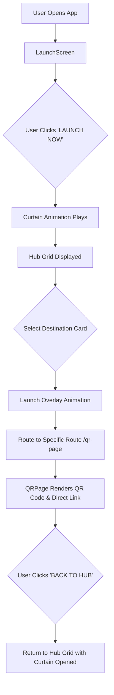

# 🚀 IIC Launching Portal — Amrita Vishwa Vidyapeetham

[](https://react.dev/)
[](https://vitejs.dev/)
[](https://reactrouter.com/)
[](LICENSE)

An interactive, sci-fi inspired web launchpad created for the **Institution's Innovation Council (IIC)** at **Amrita Vishwa Vidyapeetham**. The portal serves as a centralized gateway to access official mobile applications, knowledge portals, newsletters, and student project domain tracks.

---

## 📋 Table of Contents

- [Overview](#-overview)
- [Key Features](#-key-features)
- [Destination Modules](#-destination-modules)
- [Tech Stack](#-tech-stack)
- [Repository Structure](#-repository-structure)
- [Getting Started](#-getting-started)
  - [Prerequisites](#prerequisites)
  - [Installation](#installation)
  - [Development Server](#development-server)
  - [Building for Production](#building-for-production)
  - [Linting](#linting)
- [Configuration Guide](#-configuration-guide)
  - [Configuring Links](#1-configuring-destination-links)
  - [Modifying Launch Cards](#2-modifying-launch-cards)
  - [Customizing Logos](#3-customizing-header-logos)
- [Architecture & Application Flow](#-architecture--application-flow)
- [Deployment Instructions](#-deployment-instructions)

---

## 🌌 Overview

The **IIC Launching Portal** provides an immersive user experience designed to showcase and distribute IIC's ecosystem of products. When users open the application:
1. They are presented with a futuristic starfield canvas and a central **LAUNCH NOW** trigger.
2. Clicking **LAUNCH NOW** initiates a dynamic split curtain opening transition.
3. Users select from a grid of destination cards (e.g., **IIC HUB**, **GYAN**, **IIC NEWSLETTER**, **STF**).
4. Each card routes to a specialized detail view featuring a live, dynamically rendered **QR Code** and direct access links for phone scanning or desktop downloading.

---

## ✨ Key Features

- **Sci-Fi Animated Theme**: Features a background starfield animation with randomized twinkling stars.
- **Interactive Launch Sequence**: Dynamic curtain-reveal animation on launch trigger with visual launch success status overlay.
- **Dynamic QR Code Generation**: Instant QR code generation powered by `qrcode.react` (`QRCodeSVG`) for mobile downloading and quick access.
- **Glassmorphism UI & Glowing Accents**: Modern aesthetic using HSL color styling, high-contrast badges, glowing hover states, and smooth transitions.
- **Single Page Application Routing**: Client-side navigation handled via `react-router-dom` with state persistence for seamless back-navigation.
- **Centralized Link Management**: All target URLs are decoupled into a single configuration file (`src/config.js`) for effortless updates.

---

## 🎯 Destination Modules

| Module | Category | Description | Access Method |
| :--- | :--- | :--- | :--- |
| **🚀 IIC HUB** | Mobile App | Attendance & Task Management Application | Google Drive Download / QR Scan |
| **🌐 GYAN** | Website | Knowledge portal for campus innovation | Direct Web Portal (`gyan.cb.amrita.edu`) |
| **📰 IIC NEWSLETTER** | Publication | Latest news, event updates & achievements | Digital Publication Link / QR Scan |
| **🛸 STF** | Track | Student Task Force project working domains | Resource PDF / Working Domain Link |

---

## 🛠️ Tech Stack

- **Frontend Library**: [React 19](https://react.dev/)
- **Build Tool / Bundler**: [Vite 8](https://vitejs.dev/)
- **Routing**: [React Router DOM v7](https://reactrouter.com/)
- **QR Code Engine**: [`qrcode.react`](https://github.com/zpao/qrcode.react)
- **Styling**: Vanilla CSS3 with CSS Variables, Flexbox/Grid layouts, & `@keyframes` animations
- **Code Quality**: ESLint 10 with React Hooks & React Refresh plugins

---

## 📁 Repository Structure

```
Launching-page/
├── public/
│   ├── favicon.svg          # Application favicon
│   ├── icons.svg            # SVG iconography
│   ├── logo1.png            # Institution / Organization Logo 1
│   └── logo2.png            # Institution / Organization Logo 2
├── src/
│   ├── assets/              # Static media assets
│   ├── components/
│   │   ├── LaunchCard.jsx   # Interactive destination card with custom accents & badges
│   │   ├── Logos.jsx        # Dual-logo header display component
│   │   ├── QRPage.jsx       # Universal template for QR code & download pages
│   │   └── StarField.jsx    # Canvas/CSS particle starfield generator
│   ├── pages/
│   ├── GyanPage.jsx         # Destination wrapper for Gyan portal
│   ├── IICHubPage.jsx       # Destination wrapper for IIC Hub mobile app
│   ├── LaunchScreen.jsx     # Main launchpad screen (curtain reveal + card grid)
│   ├── NewsletterPage.jsx   # Destination wrapper for Newsletter publication
│   └── STFPage.jsx          # Destination wrapper for STF domain track
│   ├── App.css              # Main app layout styles
│   ├── App.jsx              # React Router route configuration
│   ├── config.js            # Centralized destination URLs configuration
│   ├── index.css            # Global CSS variables, animations, & base themes
│   └── main.jsx             # React DOM entry point
├── .gitignore
├── eslint.config.js         # ESLint configuration rules
├── index.html               # HTML5 main entry document
├── package.json             # NPM dependencies & build scripts
└── vite.config.js           # Vite build & plugin settings
```

---

## 🚀 Getting Started

### Prerequisites

Ensure you have the following installed on your machine:
- **Node.js**: `v18.0.0` or higher (recommended `v20+`)
- **npm**: `v9.0.0` or higher

### Installation

1. **Clone the repository**:
   ```bash
   git clone https://github.com/rohith-1205/Launching-page.git
   cd Launching-page
   ```

2. **Install project dependencies**:
   ```bash
   npm install
   ```

### Development Server

Run the development server with Hot Module Replacement (HMR):
```bash
npm run dev
```
Open your browser and navigate to `http://localhost:5173` (or the URL displayed in your terminal).

### Building for Production

To create an optimized production build:
```bash
npm run build
```
The output artifacts will be placed in the `dist/` directory.

### Preview Production Build

To preview the built production site locally:
```bash
npm run preview
```

### Linting

To run ESLint and check for code formatting or syntax errors:
```bash
npm run lint
```

---

## ⚙️ Configuration Guide

### 1. Configuring Destination Links

All external destination URLs are defined in [`src/config.js`](file:///c:/Users/Rohith%20Sivakumar/Desktop/App_Launch__Page/Launching-page/src/config.js). To update any destination link:

```javascript
// src/config.js
export const LINKS = {
  iicHub: "https://drive.google.com/file/d/1LRMibScvc6w1S2wZEfM5kSba9t6I6jNb/view?usp=sharing/download",
  gyan: "https://gyan.cb.amrita.edu/",
  newsletter: "https://your-newsletter-link-here.com", // Replace with active link
  stf: "https://drive.google.com/file/d/1dxyKZYGulS8f-s7gD53N3ePc96J10MXi/view?usp=sharing",
};
```

### 2. Modifying Launch Cards

Launch cards displayed on the main hub grid are defined in [`src/pages/LaunchScreen.jsx`](file:///c:/Users/Rohith%20Sivakumar/Desktop/App_Launch__Page/Launching-page/src/pages/LaunchScreen.jsx). You can change icons, titles, taglines, badges, or accent colors in the `CARDS` array:

```javascript
const CARDS = [
  {
    icon: '🚀',
    title: 'IIC HUB',
    tagline: 'Attendance and task management app',
    badgeText: 'MOBILE APP',
    badgeColor: '#00f0ff',
    accentColor: '#00f0ff',
    route: '/iic-hub',
  },
  // Add or modify existing cards...
];
```

### 3. Customizing Header Logos

Header logos shown on top of all pages are located in the `public/` directory:
- [`public/logo1.png`](file:///c:/Users/Rohith%20Sivakumar/Desktop/App_Launch__Page/Launching-page/public/logo1.png): Primary organization logo (e.g. Amrita logo).
- [`public/logo2.png`](file:///c:/Users/Rohith%20Sivakumar/Desktop/App_Launch__Page/Launching-page/public/logo2.png): Secondary council logo (e.g. IIC logo).

---

## 🏗️ Architecture & Application Flow



---

## 🌐 Deployment Instructions

### Deploying on Vercel / Netlify / GitHub Pages

1. **Vercel**:
   - Import the repository into Vercel.
   - Build Command: `npm run build`
   - Output Directory: `dist`

2. **Netlify**:
   - Link repository.
   - Set Build Command to `npm run build` and Publish Directory to `dist`.

3. **Static Web Server (Nginx / Apache)**:
   - Run `npm run build`.
   - Copy the contents of the `dist/` directory to your web server root.
   - Ensure rewrite rules redirect single-page application routes to `index.html`.

---

## 👥 Authors & Acknowledgments

Developed for **Institution's Innovation Council (IIC)**, **Amrita Vishwa Vidyapeetham**.

---

